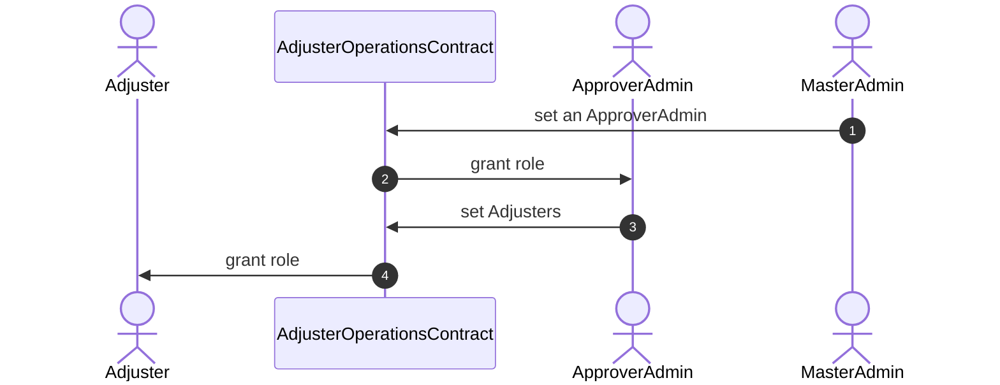

# On-Chain Car Insurance

## Introduction

This project aims to implement an on-chain version of car insurance. Users can apply for insurance policies, which are approved or denied by admin insurance adjusters, who also determine risk factors for the given user in order to calculate the premium that must be paid to maintain coverage.

Users can then activate their policy by providing payment in the form of ERC20 token, which is pooled together and supplied to a lending pool with Aave integration in order to generate yield. When a policy is activated, the user will receive an ERC721 NFT to signify their coverage.

Later on, users can make a claim on their insurance policy in order to get a payout, or extend existing coverage within a certain time frame. There are a multitude of admin roles that govern the process, in particular around approving insurance applications.

## Getting Started

### Setup

This project was built with hardhat-foundry, with Solidity-based Foundry tests.

### Testing

To run the tests and view code coverage:

```
$ forge coverage
```

### Deployment

Fill in `.env.example` with required values.

`MASTER_ADMIN` is the admin for the `AdjusterOperations.sol` contract, `PAYMENT_TOKEN_ADDRESS` is the address of the accepted ERC20 token for payment, and `POOL_ADDRESS` is the address of the Aave lending pool for accruing yield.

The values in `.env.example` are for Sepolia so `RPC_URL` should also correspond to Sepolia.

To simulate a deployment:

```
$ forge script script/DeploymentSuite.s.sol --rpc-url $RPC_URL
```

## Architecture

There are primarily 4 smart contracts that govern the functionality:

- `InsuranceManager.sol`
- `InsuranceCoverageNFT.sol`
- `YieldManager.sol`
- `AdjusterOperations.sol`

### Insurance Application

Manages most of the user-facing implementation for insurance. Users can apply for insurance, creating a pending application. They also provide some hashed data for personal details that might not be best stored directly on-chain. Then their plan is reviewed by an Adjuster, who gives the application a risk score and either approves or rejects the application. Based on that risk score, a premium is calculated.

The User then has a window (of 7 days) to activate the insurance by providing ERC20 token, paying for some amount of subscription time relative to the premium (which is a per-second cost). The User can also extend their coverage up to some maximum amount of time. Later, they can claim a policy and extract the amount of value for the coverage which they have purchased.

### InsuranceCoverageNFT

When the policy is activated by the User, an NFT is generated to represent their insurance claim. The User is free to burn the token if they want to revoke coverage; otherwise, their coverage is only valid up until the end date defined by the amount of ERC20 token they have provided relative to their premium

#### User Lifecycle

This contract manages the majority of the user-facing executions. It provides an interface that users can directly execute transactions from.

Here is the flow for the lifecycle of a User as they apply for insurance, pay for the plan, and claim a policy.



#### Access Controls

There are complex access controls, mostly involving the Adjusters. There is a Master Admin defined in the AdjusterOperations contract, with the power of granting Approver roles. Those Approvers have the power to provision Adjusters. There is a requirement of 1 Approver and 3 Adjusters for normal operations to commence. Separation of access controls here provides a more secure way of managing the different operations.

### Insurance Adjusters Lifecycle

Here is the flow for the lifecycle of Insurance Adjusters as they get approved.

## Further Improvements

There are many potential improvements possible for this project:

- more optimized yield: there could be more flexible yield rather than purely AaveV3 related lending. There could also be more complex and clean management of the treasury. In particular, the YieldManager contract should be updated to define treasury admins that are allowed to withdraw the yield for profit. As it currently stands, tokens can be locked inside the contract without a means of withdrawing this yield.
- governance features for Adjuster approval: currently the Master Admin can just set up Approvers, and they can just set up Adjusters. This process can be much more decentralized and optimized by providing governance, perhaps with a governance token, which would allow these admins to be added via vote.
- Adjuster management: Adjusters can also be managed more optimally by having a reputation system that will result in penalties for poor performance. Also, they do not currently earn anything from the yield, and this would improve the overall incentive structure of the system. Also, only 1 Adjuster is required to review an application, which can be flawed.
- more complex risk logic for calculating premiums: currently a very basic formula is applied to calculate premiums, based on the value of the insurance policy and the risk factor supplied by Adjusters. This can be combined with off-chain personal data such as driver history or location.
- more payment token options: currently only 1 payment token is accepted. This can be more flexible and also adjustable.
- upgradability: including upgradable contracts would improve the flexibility of the system long-term to adapt to some of the changes described. This is particularly useful if there is already tokens stored in the contract and migration is cumbersome.

## Appendix
